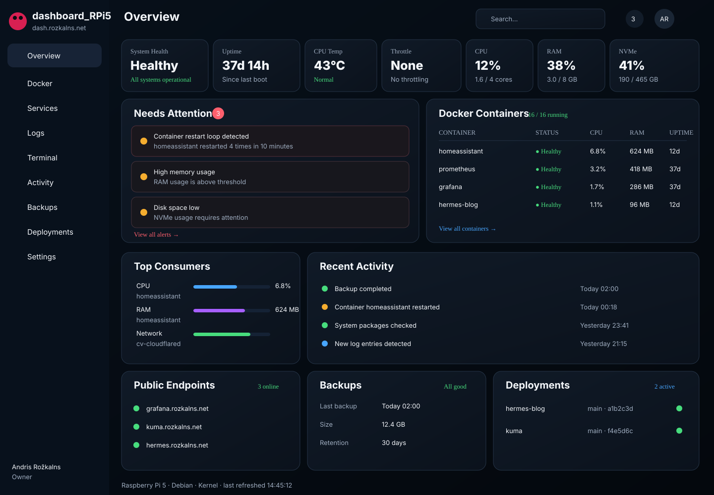
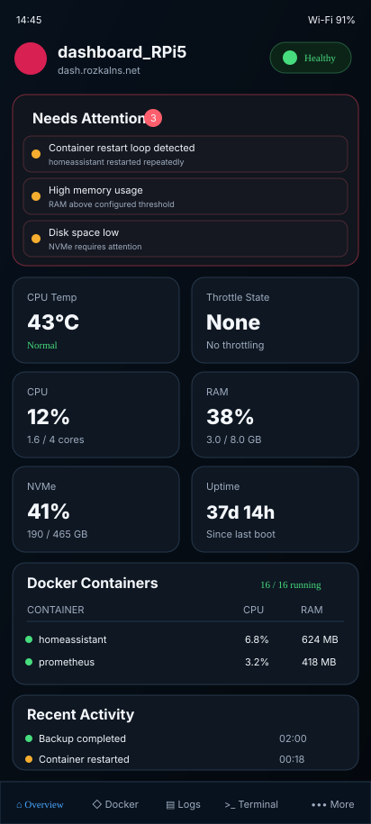

# dashboard_RPi5

Modern Raspberry Pi 5 homelab observability and control dashboard for **`https://dash.rozkalns.net`**.

> **Current production status:** MVP Operator Usable P0–P3 is accepted in production. Release `a39fc7a9873eedb58cfa49568f9b2e05483cf7c2` is active; host and bounded Docker current-state reads, registered Docker logs, four fixed read-only Quick Commands, and bounded recent Docker events are live through the dedicated broker/agent boundaries. The dedicated Docker broker remains the sole Docker Engine authority, terminal/PTTY remains absent/fail-closed, and Cloudflare Access/Tunnel/DNS are unchanged. The public dashboard remains owner-only behind Cloudflare Access. GitHub `main` may be newer than this production SHA; a merged source change is not production evidence until it is separately deployed and accepted.

> **Current-state handoff:** [Issue #171 — canonical continuity / handoff](https://github.com/rozkalnsandris/dashboard_RPi5/issues/171)
>
> **Canonical product/security contract:** [Issue #1 — MASTER / READ FIRST](https://github.com/rozkalnsandris/dashboard_RPi5/issues/1)

## Current UI direction

### Desktop



### Samsung Galaxy A55



More: [`docs/MOCKUPS.md`](docs/MOCKUPS.md).

## Goal

`dashboard_RPi5` is the daily operations cockpit for the Raspberry Pi 5. It should answer, in seconds:

1. Is the Pi healthy?
2. What is using resources or behaving abnormally?
3. What changed recently?
4. Where are the relevant logs?
5. What is the safest next diagnostic action?

It is **not** intended to replace Grafana, Prometheus, Uptime Kuma or Portainer. It brings the most important evidence into one purpose-built interface and deep-links to specialist tools for deeper analysis.

## Planned views

- **Overview** — health, temperature, throttle/power flags, CPU, RAM, NVMe, Docker and attention items.
- **Docker** — container state plus CPU/RAM/network/block-I/O usage.
- **Services** — allowlisted host/systemd service state.
- **Logs** — allowlisted Docker, journal and registered application logs with live follow.
- **Terminal** — Quick Commands first; full owner PTY only in a later hardened phase.
- **Activity** — Docker/service/backup/deploy/endpoint timeline.
- **Backups** — last run, freshness, duration, size and history.
- **Deployments** — GitHub `main` versus proven production SHA and deploy classification.

## Samsung Galaxy A55 first-class mobile target

The Galaxy A55 5G is the physical mobile acceptance device.

The implementation is responsive, not device-sniffed:

- works from 320 CSS px upward;
- compact-phone design tuned around 360–430 CSS px;
- Samsung Browser + Chrome;
- browser + installed PWA;
- portrait + landscape;
- keyboard-safe Logs/Terminal;
- 48px normal touch targets and larger primary actions;
- zoom remains enabled;
- safe-area insets come from the browser.

See:

- [`docs/MOBILE_SAMSUNG_A55.md`](docs/MOBILE_SAMSUNG_A55.md)
- [`docs/HTML_CSS_MOBILE_IMPLEMENTATION.md`](docs/HTML_CSS_MOBILE_IMPLEMENTATION.md)

## Architecture

```text
Browser / phone
    |
    | HTTPS + Cloudflare Access
    v
Cloudflare Tunnel
    |
    v
Dashboard web/API on RPi5 loopback
    |-- Prometheus history reads
    |-- Grafana deep links
    |
    | Unix socket / narrow local protocol
    v
RPi5 privileged-read agent
    |-- bounded Docker broker Unix socket
    |       `-- Docker Engine Unix socket
    |-- systemd / journal
    |-- vcgencmd / sysfs / procfs
    `-- allowlisted backup/deploy evidence
```

The **web process does not get arbitrary root access or an unrestricted Docker API proxy**. The main agent has no persistent `docker` or `video` group membership; only the dedicated bounded Docker broker reaches the Docker Engine socket.

## Security baseline

- Cloudflare Access in front of `dash.rozkalns.net`.
- No new router port-forward.
- Agent is not Internet-facing.
- Docker socket is never exposed to browser JavaScript.
- Docker current-state reads use the dedicated bounded broker; the main agent is not persistently in `docker` or `video`.
- Bounded recent Docker events are production-active through the dedicated broker capability; there is no generic Docker Engine proxy.
- Registered Docker logs are production-active through the dedicated broker path and remain allowlisted/bounded.
- Read-only observability first.
- Browser-supplied log paths/service names/shell strings are rejected.
- Quick Commands are production-active only through the fixed four-command read-only allowlist. Conservative base/bootstrap contracts intentionally remain fail-closed and disabled-by-default; the accepted production capability state is an explicit activation overlay, not a reason to weaken those defaults.
- Terminal/PTTY remains absent/fail-closed in production; any future activation is separately gated.
- Any future production/host mutation requires separate explicit owner authorization.

## GitHub workflow

```text
issue -> fresh main -> branch -> focused change -> Draft PR
      -> exact-head CI/manual review -> Ready -> STOP
      -> explicit owner squash merge -> exact-main verify
      -> Production deploy: YES/NO
```

**Merge authorization is not deployment authorization.**

See [`AGENTS.md`](AGENTS.md) and [`CONTRIBUTING.md`](CONTRIBUTING.md).

## Repository documents

- [`AGENTS.md`](AGENTS.md) — mandatory worker/assistant rules.
- [`CONTRIBUTING.md`](CONTRIBUTING.md) — contribution and PR workflow.
- [`SECURITY.md`](SECURITY.md) — trust boundaries.
- [`docs/MASTER_ROADMAP.md`](docs/MASTER_ROADMAP.md) — pointer to the canonical roadmap and repository mirror.
- [`docs/PRODUCT_SPEC.md`](docs/PRODUCT_SPEC.md) — product scope/acceptance.
- [`docs/ARCHITECTURE.md`](docs/ARCHITECTURE.md) — system architecture/APIs.
- [`docs/UI_UX_SPEC.md`](docs/UI_UX_SPEC.md) — desktop/mobile visual contract.
- [`docs/MOBILE_SAMSUNG_A55.md`](docs/MOBILE_SAMSUNG_A55.md) — A55 acceptance.
- [`docs/HTML_CSS_MOBILE_IMPLEMENTATION.md`](docs/HTML_CSS_MOBILE_IMPLEMENTATION.md) — concrete mobile HTML/CSS.
- [`docs/DATA_SOURCES.md`](docs/DATA_SOURCES.md) — metrics/log/event authority.
- [`docs/PHASE2B_HOST_HEALTH.md`](docs/PHASE2B_HOST_HEALTH.md) — host health evidence contract.
- [`docs/PHASE3A_DOCKER_READ.md`](docs/PHASE3A_DOCKER_READ.md) — Docker current-state read boundary.
- [`docs/PHASE3B_DOCKER_EVENTS.md`](docs/PHASE3B_DOCKER_EVENTS.md) — bounded Docker recent-event boundary.
- [`docs/PHASE4A_PROMETHEUS_HISTORY.md`](docs/PHASE4A_PROMETHEUS_HISTORY.md) — bounded Prometheus history and Grafana-link boundary.
- [`docs/TERMINAL_AND_LOGS_SECURITY.md`](docs/TERMINAL_AND_LOGS_SECURITY.md) — terminal/log boundary.
- [`docs/RESEARCH_2026-08-15.md`](docs/RESEARCH_2026-08-15.md) — research sources.
- [`docs/MOCKUPS.md`](docs/MOCKUPS.md) — visual concepts.
- [`docs/adr/`](docs/adr/) — durable decisions.

## Development principle

```text
observe -> explain -> drill down -> act only through an explicit trusted gate
```

**Production deploy:** the accepted active production release is `a39fc7a9873eedb58cfa49568f9b2e05483cf7c2`. GitHub `main` can be ahead of production after later source-only merges; any future production deploy or host/trust-boundary mutation requires a new separate explicit owner authorization.
