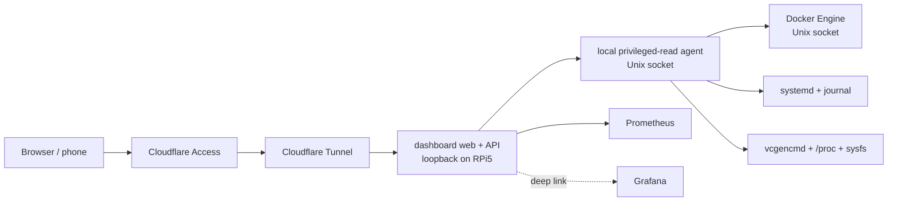

# Architecture

## Final hostname

The human-facing application is **`https://dash.rozkalns.net`**.

## Chosen topology

For this single-host product, the preferred first architecture is deliberately simpler than a cloud-hosted hub/remote-agent system:



### Why this topology

- no inbound router port;
- no second Internet-facing agent hostname;
- the dashboard frontend/API can remain unprivileged;
- the privileged helper is not network-exposed;
- terminal WebSocket does not require an additional cloud relay;
- easy to deploy and debug on one Pi;
- later we can externalize/cache last-known status if Pi-offline visibility becomes a real requirement.

## Processes

### `dashboard-rpi5-web`

Responsibilities:

- serve React/Vite assets;
- authenticated normalized API;
- query Prometheus for historical metrics;
- communicate with local agent through Unix socket;
- enforce request validation and response shaping;
- host terminal WebSocket endpoint only after the terminal phase is authorized.

Must not:

- execute arbitrary shell commands;
- receive Docker socket directly;
- run as root.

### `dashboard-rpi5-agent`

Host-side systemd service.

Responsibilities:

- Raspberry Pi temperature/throttle state;
- safe `/proc`/sysfs reads;
- Docker current stats/events/logs through the local Engine socket;
- allowlisted systemd state and journal queries;
- registered backup/deploy evidence;
- registered Quick Commands;
- later, bounded PTY session creation.

Recommended transport:

```text
/run/dashboard-rpi5/agent.sock
```

Permissions should allow only the dashboard web service identity to connect.

## Browser-facing API

```text
GET  /api/health
GET  /api/rpi/summary
GET  /api/rpi/docker
GET  /api/rpi/docker/:containerId
GET  /api/rpi/services
GET  /api/rpi/activity
GET  /api/rpi/backups
GET  /api/rpi/deployments
GET  /api/rpi/logs?sourceId=...
GET  /api/rpi/logs/stream?sourceId=...
POST /api/rpi/quick-command             # later gated phase
POST /api/rpi/terminal/session          # later gated phase
WS   /api/rpi/terminal/:sessionId       # later gated phase
```

## Agent interface

Purpose-built operations only; no arbitrary method/proxy endpoint.

```text
GET  /v1/health
GET  /v1/summary
GET  /v1/docker
GET  /v1/docker/:id
GET  /v1/services
GET  /v1/activity
GET  /v1/backups
GET  /v1/logs
GET  /v1/logs/stream
POST /v1/quick-command                  # registered IDs only
POST /v1/terminal/session               # later
```

## Data ownership

- Prometheus owns time-series history.
- Grafana owns deep visual analysis.
- Docker Engine owns container runtime state/events/logs.
- systemd journal owns host service logs.
- dashboard owns presentation, alert projection and minimal local UI state only.

Do not create a second metrics database merely to draw the same CPU/RAM charts.

## Deployment

Target first deployment shape:

```text
cloudflared -> 127.0.0.1:<dashboard-port>
```

Cloudflare Access protects `dash.rozkalns.net` before public use.

The exact tunnel/DNS/Access mutation is a separate owner-authorized production step.
