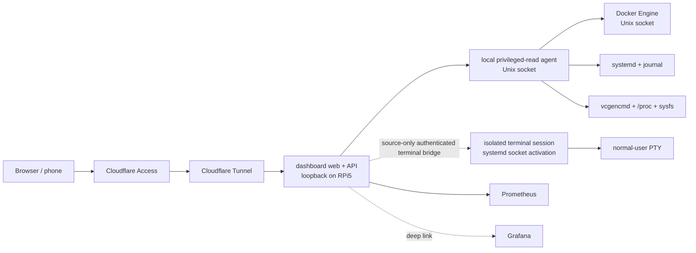

# Architecture

## Final hostname

The human-facing application is **`https://dash.rozkalns.net`**.

## Chosen topology

For this single-host product, the preferred first architecture is deliberately simpler than a cloud-hosted hub/remote-agent system while keeping the full terminal in a separate local execution boundary:



### Why this topology

- no inbound router port;
- no second Internet-facing agent hostname;
- the dashboard frontend/API can remain unprivileged;
- the privileged-read helper is not network-exposed;
- the terminal runtime does not inherit Docker/journal/host-read privileges from that helper;
- terminal WebSocket does not require an additional cloud relay;
- easy to deploy and debug on one Pi;
- later we can externalize/cache last-known status if Pi-offline visibility becomes a real requirement.

## Processes

### `dashboard-rpi5-web`

Responsibilities:

- serve React/Vite assets;
- authenticated normalized API;
- query Prometheus for historical metrics;
- communicate with local helpers only through narrow Unix-socket protocols;
- enforce request validation and response shaping;
- host the authenticated terminal WebSocket gateway only behind the explicit terminal gate.

Must not:

- execute arbitrary shell commands itself;
- receive Docker socket directly;
- load `node-pty`;
- run as root.

Phase 9I adds the source-only terminal bridge in this process. The bridge can connect only to the fixed filesystem path `/run/dashboard-rpi5-terminal.sock`; it does not spawn a PTY or accept a browser-selected socket path, executable, argv, cwd, env, uid/gid or shell path.

### `dashboard-rpi5-agent`

Host-side privileged-read systemd service.

Responsibilities:

- Raspberry Pi temperature/throttle state;
- safe `/proc`/sysfs reads;
- Docker current stats/events/logs through the local Engine socket;
- allowlisted systemd state and journal queries;
- registered backup/deploy evidence;
- registered Quick Commands when separately authorized.

Recommended transport:

```text
/run/dashboard-rpi5/agent.sock
```

Permissions should allow only the dashboard web service identity to connect.

The read agent must not load `node-pty` or host the free-form shell. This avoids a terminal process inheriting future Docker/journal/host-read group privileges.

### `dashboard-rpi5-terminal-agent`

Separate local execution boundary for the future full terminal.

Phase 9G created the native module/build boundary. Phase 9H added a source-only local protocol and systemd containment blueprint. Phase 9I adds the source-only authenticated server-to-local protocol bridge, while production socket/user/group activation remains separately owner-gated.

Required properties:

- Linux only;
- dedicated non-root execution identity;
- no privileged supplementary groups;
- no Docker socket or journal privilege;
- no automatic sudo/elevation;
- fixed server-side shell contract;
- minimal fresh environment rather than inherited service secrets;
- one bounded PTY session at a time;
- local Unix socket only;
- one accepted connection maps to one systemd service instance/cgroup;
- no writable delegated cgroup subtree;
- PID 1 owns final process-tree cleanup through `KillMode=control-group`;
- application 5-minute idle / 30-minute absolute lifetime plus independent systemd `RuntimeMaxSec=30min`.

Source-only transport target:

```text
/run/dashboard-rpi5-terminal.sock
```

The socket uses `Accept=yes`, `MaxConnections=1`, mode `0660`, and a dedicated `dashboard-rpi5-terminal-client` connector group. Each accepted connection launches `dashboard-rpi5-terminal@.service` with the connection attached to stdin/stdout. The service runs the `session-stdio-entry` worker and the Phase 9G native PTY under the same systemd cgroup.

The service is intentionally not cgroup-delegated. `ProtectControlGroups=yes` keeps cgroup management away from the shell, while service teardown uses `KillMode=control-group`, `SendSIGKILL=yes` and a short stop timeout so detached descendants cannot survive ordinary worker exit. A 30-minute systemd runtime limit is an independent backstop.

The exact production users/groups, web-service socket-group membership, unit installation and activation remain owner-gated production decisions and are not performed by source merges.

## Browser-facing API

```text
GET  /api/health
GET  /api/rpi/summary
GET  /api/rpi/docker
GET  /api/rpi/docker/:containerId
GET  /api/rpi/services
GET  /api/rpi/activity
GET  /api/rpi/backups
GET  /api/rpi/deployments
GET  /api/rpi/logs?sourceId=...
GET  /api/rpi/logs/stream?sourceId=...
POST /api/rpi/quick-command             # gated
POST /api/terminal/session              # implemented, production-disabled by default
WS   /api/terminal/ws                   # authenticated bridge; production local socket still inactive
```

## Browser full-terminal surface

Phase 9J adds a source-only xterm surface to the existing `/terminal` page while keeping Quick Commands as the first read-only diagnostic path.

Opening the route does not create a terminal session. The owner must explicitly press **Start terminal**. Each attempt then:

1. POSTs the exact empty request to `/api/terminal/session`;
2. strictly validates the returned one-time 64-hex capability and fixed lifetime contract;
3. connects to the fixed same-origin `/api/terminal/ws` endpoint;
4. supplies the capability only through the existing `session.<token>` WebSocket subprotocol alongside `dashboard-rpi5-terminal-v1`;
5. keeps xterm stdin disabled until the server emits `ready`;
6. translates xterm input only to bounded `input` frames and fitted dimensions only to bounded `resize` frames.

The browser does not put the token in the URL, DOM, React state, localStorage or sessionStorage. There is no automatic reconnect: every new start attempt must mint a fresh capability.

The UI uses stable `@xterm/xterm` as the VT renderer/input surface and `@xterm/addon-fit` for terminal-grid measurement. It deliberately does not use `@xterm/addon-attach`, because raw WebSocket attachment would bypass the authenticated bounded application protocol already defined by Phases 9E–9I.

The browser independently bounds one xterm input event, splits it so both the server's 2 KiB UTF-8 input-data limit and 4 KiB serialized WebSocket-frame limit hold, rejects NUL input, and accepts only strict `ready`, bounded `output` and non-negative `exit` frames. These checks improve UX and reduce accidental invalid traffic; the server remains authoritative for security.

Samsung Galaxy A55-class mobile handling uses the existing `412x915` acceptance viewport, 48 px touch controls, xterm keyboard focus support, `ResizeObserver`, `visualViewport.resize` and `FitAddon.fit()` through one animation-frame-coalesced resize path. The page must not horizontally overflow, and reduced mobile viewport height must produce a fresh bounded terminal resize rather than a page-layout break.

Terminal output remains ephemeral in the page's xterm buffer. The dashboard does not copy it into app history, storage or telemetry. Route teardown aborts pending admission, closes the active WebSocket and disposes xterm.

## Read-agent interface

Purpose-built operations only; no arbitrary method/proxy endpoint.

```text
GET  /v1/health
GET  /v1/summary
GET  /v1/docker
GET  /v1/docker/:id
GET  /v1/services
GET  /v1/activity
GET  /v1/backups
GET  /v1/logs
GET  /v1/logs/stream
POST /v1/quick-command                  # registered IDs only
```

There is intentionally no free-form terminal endpoint on the privileged-read agent.

## Terminal-agent local protocol

The contained session worker reads newline-delimited JSON from its socket-backed stdin and writes only bounded protocol frames to socket-backed stdout.

The first local client frame is emitted by the server bridge, never by browser-controlled raw forwarding, and must be exactly:

```json
{"v":1,"type":"open","cols":80,"rows":24}
```

After local `ready`, the server translates only validated browser `input` and `resize` messages into the versioned local protocol. There is no command/executable/argv/cwd/env/uid/gid field in either browser-to-local translation path. Browser messages arriving before local `ready`, malformed/oversized frames, binary frames, unexpected local frames or backpressure overload fail closed.

PTY output is treated as untrusted data, is capped per native callback, split into bounded Unicode-safe chunks, parsed again by the server-side local-wire decoder and only then serialized into the browser protocol. Terminal frame contents are not persisted or logged.

The bridge uses Node Unix-domain IPC only at the fixed path `/run/dashboard-rpi5-terminal.sock`, has a bounded local-connect deadline, destroys the local connection on browser disconnect/error, revokes the one-time terminal capability on every terminal path exit, and keeps both local-write and WebSocket-output buffering bounded.

## Data ownership

- Prometheus owns time-series history.
- Grafana owns deep visual analysis.
- Docker Engine owns container runtime state/events/logs.
- systemd journal owns host service logs.
- dashboard owns presentation, alert projection and minimal local UI state only.

Do not create a second metrics database merely to draw the same CPU/RAM charts.

## Deployment

Target first web deployment shape:

```text
cloudflared -> 127.0.0.1:<dashboard-port>
```

Cloudflare Access protects `dash.rozkalns.net` before public use.

The exact tunnel/DNS/Access mutation, terminal-agent user/group creation, web-service connector-group membership, socket/service installation, execution identity, feature-gate enablement and activation are separate owner-authorized production steps.
